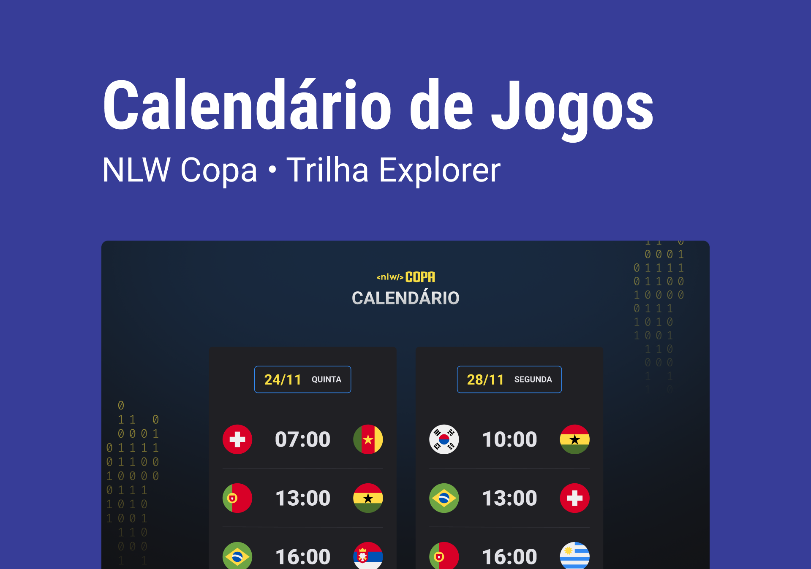

<h1 align="center"> NLW #10 - Copa </h1>

Evento exclusivo e gratuito, promovido pela Rocketseat para ensino de tecnologias WEB.

  

 

  

## 🚀 Tecnologias

Esse projeto foi desenvolvido com as seguintes tecnologias:

- HTML e CSS
- JavaScript e JSON
- Git e GitHub

## 💻 Projeto

O NLW Copa teve como tema, o calendário da copa do mundo 2022.

## 🔖 Layout

Você pode visualizar o layout do projeto através [DESSE LINK](https://www.figma.com/file/n0lr7tH3JYkpq52P3l0G6G/Calend%C3%A1rio-de-Jogos-(Community)?node-id=0%3A1). É necessário ter conta no [Figma](https://figma.com) para acessá-lo.

## 📎 Licença

Esse projeto está sob a licença MIT.
